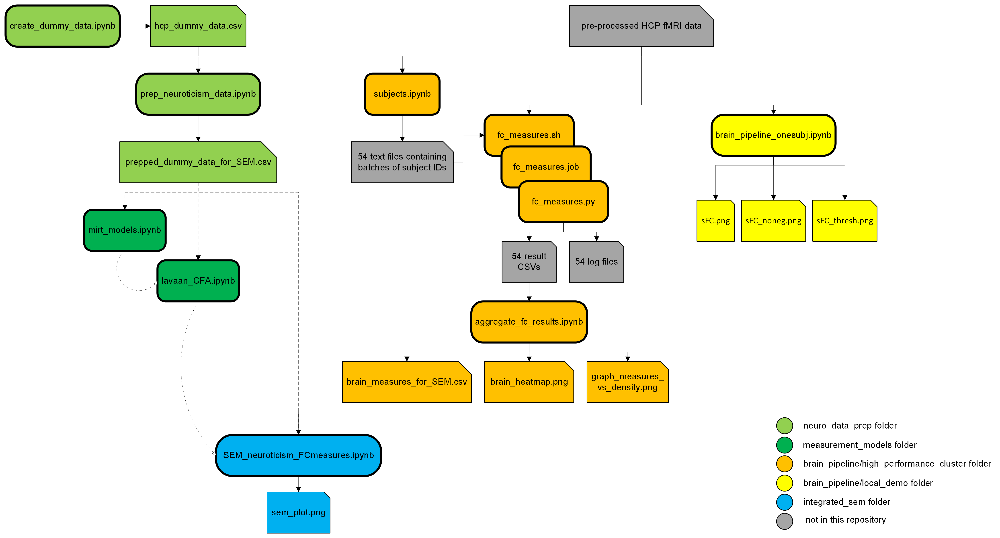

# A Neural Signature of Neuroticism?
**Exploring the Functional Connectome to Predict Personality**

Welcome to the supplementary material repository for my practical project! <br>
This repository contains the more detailed workflow, pipelines, and supplementary materials associated with my poster presentation. <br>
Find a digital copy of my [Research Poster](./poster_neuroticism_connectome.pdf) here!

**Project Contributors**:
- Author: Jana Bormann
- Supervisors: Micha Burkhardt and Prof. Dr. Andrea Hildebrandt

## 🔐 Open Data (Protected Access)
This project utilizes the **Human Connectome Project** Young Adult dataset (2025 Release). Specifically, this project utilizes:
- Resting State fMRI 3T Preprocessed (Recommended) Neuroimaging Data and
- Restricted Access Behavioral Data (.csv)

##### 📝 Data Access
The HCP-YA **neuroimaging data** is available to all registered users upon creating an account and accepting the standard [Open Access Data Use Terms](https://www.humanconnectome.org/study/hcp-young-adult/document/wu-minn-hcp-consortium-open-access-data-use-terms). <br>
Accessing the **restricted behavioral data** requires a formal [Restricted Access application](https://www.humanconnectome.org/study/hcp-young-adult/document/restricted-data-usage). <br> 
Once the respective permissions are granted, both the imaging and behavioral data can be accessed and downloaded through the [BALSA database](https://balsa.wustl.edu/).


## 📂 Open Materials / Repository Structure
Here you can find the detailed materials for my project pipeline. Navigate through the folders below to see the specific steps:
* **`/neuro_data_prep`**: Neuroticism data preparation
* **`/measurement_models`**: Code and results for the tested measurement models
* **`/brain_pipeline`**: The brain measure calculation pipeline
* **`/integrated_sem`**: SEM (Structural Equation Modeling) results, outputs, and visualizations

For a **complete visual guide** to the repository's logic - from raw data to final SEM results - see this Workflow Map:


(click to enlarge)

## 🛠️ Tools & Technologies
* **Software Stack:** Jupyter Notebooks running a Conda environment
* **Languages:** Python, R
* **Integration:** `rpy2`
* **Neuroimaging:** [Comet Toolbox](https://doi.org/10.1162/IMAG.a.1122)
* **Statistical Modeling:** `mirt`, `lavaan`

## ⚙️ Installation
To ensure computational reproducibility and prevent version conflicts, this repository contains a **environment.yml** file. This allows to recreate the exact environment used for this study, including all Python and R dependencies.
To set up the environment on your local machine, run the following command in your terminal or Anaconda Prompt (after navigating to the folder that contains the yml file): <br>

```
conda env create -f environment.yml
conda activate neuro_env
```

## 🚀 Usage
This repository is organized to follow the logical flow of the research project. <br> 
You can use these materials to **verify specific steps**, **explore extended results**, or **replicate the entire study**.

###  Interactive Exploration
Have **questions about the methodology or results**? Find the answers directly within the folders! (Refer to the [Workflow Map](#-open-materials--repository-structure) above to quickly locate your files of interest)

- How were the raw **behavioral data preprocessed** for latent trait modeling? ➜ See `/neuro_data_prep` 
- Which specific **models** were **tested**, and how did they perform compared to the final poster version? ➜ See `/measurement_models` 
- Which specific **methods and parameters** were used for **functional connectivity** estimation? ➜ See `/brain_pipeline` 
- On what basis were the **threshold densities** for the AUC integration chosen? ➜ See `/brain_pipeline` 

**Narrative Code**: All scripts and notebooks contain **explaining commentary** to guide you through the research logic. <br>
**Execution Evidence**: Every step is documented in **Jupyter Notebooks**, allowing you to see the actual code execution and intermediate results. (For steps that required high-performance cluster computing (such as the brain pipeline), I have provided a **local demo** notebook so you can run a "lite" version of the workflow on your own machine.)


### Full Pipeline Replication
To replicate this project from scratch, ensure you have first completed the [Data Access](#-data-access) and [Installation](#%EF%B8%8F-installation) steps.

- **Order of Execution**: Simply follow the logical flow illustrated in the [Workflow Map](#-open-materials--repository-structure) above. The repository structure is designed to guide you step-by-step from raw data processing through to the final SEM integration.
- **Customizing for Your Machine**: All scripts include clear instructions on where to update local file paths (e.g., pointing to your specific HCP data directory).


**Recommended IDE**:
It is highly recommended to run the notesbooks within VS Code using the Jupyter Extension for better management of the Conda kernel and rpy2 interface.


